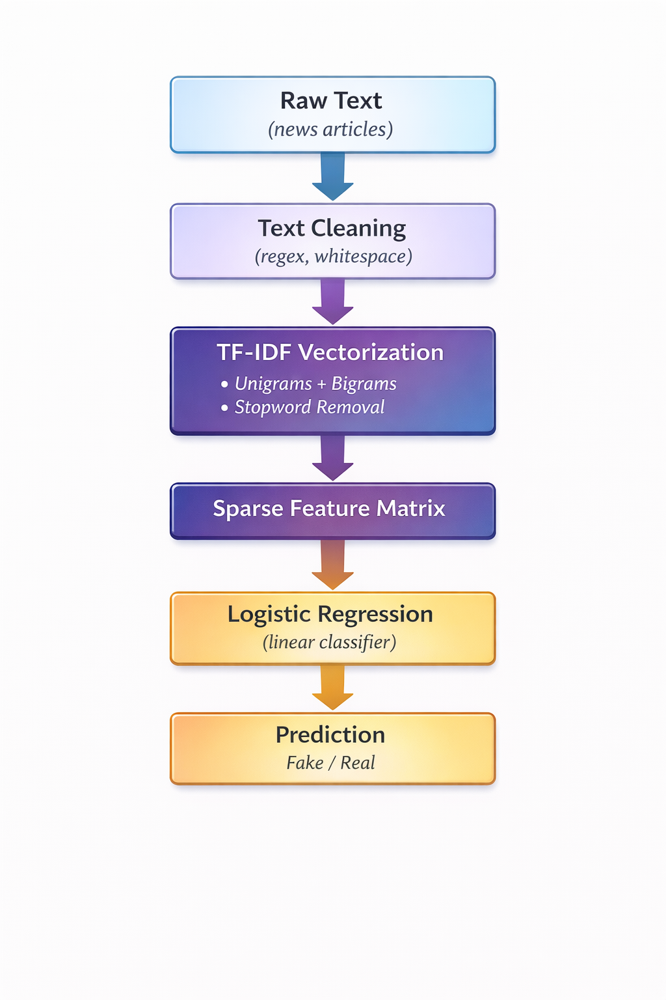
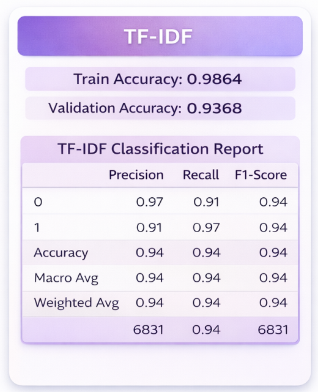

# Fake news detection with NLP

**IronHack AI Engineering Bootcamp – January 2026**  
[Project in GitHub](https://github.com/santogatobaron/NLPchallenge)

---

## Project Goal

Build a **Natural language processing (NLP)** model to correctly identify whether pieces of news are real or fake news.

Given a data set of +30k headlines from pieces of news labeled as real or fake news, the project's goals are to:

  - Build different NLP models to test their performance at the task
  - Use one of those models to detect fake news in an unlabeled data set
  - Predict the accuracy rate of that model at detecting fake news 


---

## Project Overview

- **NLP models built**
  - TF-IDF + logistic regression
  - TF-IDF + random forest
  - Word2vec + Xgboost
  - TF-IDF + Naive-Bayes 

- **General preprocessing**
  - Quick EDA of format and values
  - Class balance check
  - Regex filter
  - Stopword removal
   
- **Preprocessing techniques tested in the models**
  - TF-IDF vs BoW 
  - Unigrams vs unigrams + bigrams vs n-grams 
  - Stemmers and lemmatizers
  - Parameter tuning (different in each model)

- **Evaluation**
  - Training and test accuracy
  - Confusion matrix and F1 score
  - Human interpretation based on confusion matrix and design of the models
  
- **Reporting**
  - Presentation to exhibit results, methodology, and findings

---

## Project Results

- **Model chosen for prediction**

TF-IDF (unigrams + bigrams) + Logistic Regression. [Notebook](https://github.com/santogatobaron/NLPchallenge/blob/main/models/model1_tfidf_logreg.ipynb) 





- **Other models**

  - TF-IDF + random forest. [Notebook](https://github.com/santogatobaron/NLPchallenge/blob/main/models/model2_tfidf_ranforest.ipynb) 
  - Word2vec + Xgboost. [Notebook](https://github.com/santogatobaron/NLPchallenge/blob/main/models/model2_tfidf_ranforest.ipynb) 
  - TF-IDF + Naive-Bayes. [Notebook](https://github.com/santogatobaron/NLPchallenge/blob/main/models/model4_tfidf_naivebayes.ipynb) 


---

## Project Content

### Description of Content Structure

- **data/**
  - Training and test data sets

- **models/**
  - The 4 models build. Titles are self-descriptive

- **predictions/**
  - `model_predictions/`: folder containing the prediction csv files generated by all models
  - `accuracy_estimation`: the accuracy we predict for the model chosen
  - `predictionsModel1_tfidf_logreg`: the prediction generated by our chosen model

- **presentation/**
  - `images/`: images to support presentation and reporting
  - `presentation`: ppt presentation of the project

- **requirements/**
  - The `requirements.txt` file can be used to install the environment needed to run the notebooks  
  - It is recommended to use a **virtual environment**

---

## Environment Setup

```bash
python -m venv .venv
.venv/Scripts/activate
pip install -r requirements.txt
